# DY Travel Ticket Poster

English | [简体中文](README.md)

Turn one photo or a batch of photos into a consistent series of travel-ticket posters. The Skill keeps the recognizable subject and scene from the source image, then builds a centered ticket with an adaptive color palette, a perforated information stub, neutral scene naming, a date, a serial number, and a decorative barcode.

The final deliverable for each photo is a clean `1170 × 1560` PNG in a `3:4` aspect ratio. Phone UI, notifications, player controls, and watermarks are excluded from the poster.

## What the Skill handles

- Preserves recognizable people, animals, products, buildings, vehicles, and actions
- Builds the final photo panel directly from original source pixels with aspect-preserving cropping and high-quality resampling; never uses a model-reconstructed panel or a lossy JPEG intermediate
- Selects a crop that keeps the main subject and enough environmental context
- Adapts the background and ticket-stub colors to each photograph
- Uses user-provided titles and dates when available
- Falls back to a neutral scene title when the location cannot be verified
- Creates a five-digit serial, an eight-character decorative code, and a decorative barcode
- Processes batch inputs as separate posters while keeping one visual system
- Normalizes approved outputs to `1170 × 1560` PNG without overwriting the source

## Visual system

The poster uses a restrained, repeatable layout.

- Canvas ratio is `3:4`
- The nominal ticket body is `1057 × 507px` at `x=55, y=501`
- Outer margins are locked to the measured reference at `55px` left and `58px` right; ticket width is `90.4%` of the canvas
- The photo panel occupies about `73.2%` of the ticket width and the information stub about `26.8%`
- Rounded corners, a vertical perforation, a semicircular notch, and a soft shadow stay consistent; titles use a bold face while dates, numbers, and serial codes use a light condensed monospaced face
- Decorative barcode bars are uniformly `43px` high; only bar widths and gaps vary, never their top alignment
- Exactly one square-ended perforation divider is allowed, with its first dash flush at the ticket top
- A tight contact shadow plus a wider ambient shadow grounds the complete ticket
- The canvas uses a flat environment-derived color; the default editorial soft range is OKLCH `L=0.64–0.78, C=0.02–0.08`
- The palette changes with each source photo while hierarchy and geometry remain fixed; a batch must not reuse one generic background color

Full construction details are in [references/style-spec.md](references/style-spec.md).

## Installation and tool support

This is a public repository that follows the Open Agent Skills structure. Make sure GitHub CLI is authenticated before installing it.

### Codex desktop, CLI, and IDE extension

Install it in the user-level Skills directory:

```bash
mkdir -p "$HOME/.agents/skills"
gh repo clone cxcxy/dy-travel-ticket-poster "$HOME/.agents/skills/dy-travel-ticket-poster"
```

Codex normally discovers new Skills automatically. Restart Codex if it does not appear, then invoke it with `$dy-travel-ticket-poster`.

### Codex Cloud

Codex Cloud needs the Skill inside the target project repository. The recommended setup is a submodule under `.agents/skills/` at the target repository root:

```bash
mkdir -p .agents/skills
git submodule add https://github.com/cxcxy/dy-travel-ticket-poster.git \
  .agents/skills/dy-travel-ticket-poster
git submodule update --init --recursive
```

For a private submodule, the GitHub account connected to Codex Cloud must also have read access. The standard poster path is deterministic and uses local Python, Pillow, a pinned bold title font, and a pinned light monospaced body font; image generation or editing is only needed when essential content cannot survive the crop and non-semantic scenery must be extended.

### Claude Code and other Agent Skills tools

Tools that support Agent Skills can place this repository in their own Skills directory. For example, the Claude Code user-level location is:

```bash
mkdir -p "$HOME/.claude/skills"
gh repo clone cxcxy/dy-travel-ticket-poster "$HOME/.claude/skills/dy-travel-ticket-poster"
```

Those tools still need a compatible image-generation or image-editing capability. Reading `SKILL.md` alone is not enough to complete the poster workflow.

### Codex Plugins and common companion tools

Open **Plugins** in the ChatGPT/Codex desktop app, or enter `/plugins` in Codex CLI. Start a new task after installation. Not every item below is required:

| Tool or Plugin | Purpose | Required |
| --- | --- | --- |
| Image generation / `imagegen` | Extend non-semantic scenery only when the crop cannot preserve essential content | Exception only |
| GitHub | Maintain the Skill repository and collaborate on changes | Optional |
| Google Drive / Box | Read source photos or save deliverables | Optional |
| Canva | Continue layout work or manual refinement after generation | Optional |

Plugins do not automatically receive private local photos. The user must explicitly select or authorize files. Local files remain sufficient when no companion Plugin is installed.

References: [Codex Skills documentation](https://learn.chatgpt.com/docs/build-skills) · [Codex Plugins documentation](https://learn.chatgpt.com/docs/plugins) · [Claude Code Skills documentation](https://code.claude.com/docs/en/skills)

## Use

Attach one or more local PNG or JPG photos, then ask Codex to use the Skill.

```text
Use $dy-travel-ticket-poster to convert these photos into clean 3:4 travel-ticket posters.
```

You can also provide explicit metadata.

```text
Use $dy-travel-ticket-poster for this photo. Title it WATERFRONT and use 2026 - 08.
```

For each input, the workflow inspects the photo and final crop, uses [scripts/suggest_palette.py](scripts/suggest_palette.py) to create three traceable palette previews, visually selects one, builds the poster deterministically with [scripts/render_ticket_poster.py](scripts/render_ticket_poster.py), and checks source pixels, solid background, color hierarchy, text contrast, and ticket structure with [scripts/validate_ticket_output.py](scripts/validate_ticket_output.py). `imagegen` is used only when a crop would otherwise lose essential content and non-semantic scenery must be extended.

## Metadata behavior

- A title, location, or date supplied by the user takes priority
- If no reliable location is available, the Skill uses a neutral scene word such as `COFFEE`, `KOALA`, `OLD TOWN`, or `DESERT`
- The date priority is user input, local `DateTimeOriginal`, local file date, then the current year and month
- GPS and private metadata stay local and are not included in the generation request
- The serial code and barcode are visual elements and are not guaranteed to be scannable

## Requirements

- An Agent Skills environment that supports `SKILL.md`
- Python 3.10+, the Pillow version declared in `requirements.txt`, and available bold-title plus light-monospaced-body TTF/OTF/TTC fonts
- An image-generation or image-editing tool only for exceptional non-semantic scenery extension
- Local access to the input photos

Generate palette candidates and a review sheet first:

```bash
python3 scripts/suggest_palette.py --input source.jpg --output-json palette.json --preview palette-review.png
```

See [SKILL.md](SKILL.md) for the complete deterministic render and strict validation commands.

## Reference cases

The following examples show the supplied source photo beside the generated travel-ticket poster. The documentation displays each preview at a suitable width, while the working output remains a `1170 × 1560` PNG.

### 01 · Coffee counter

<table>
  <tr><th>Original</th><th>Generated ticket poster</th></tr>
  <tr>
    <td>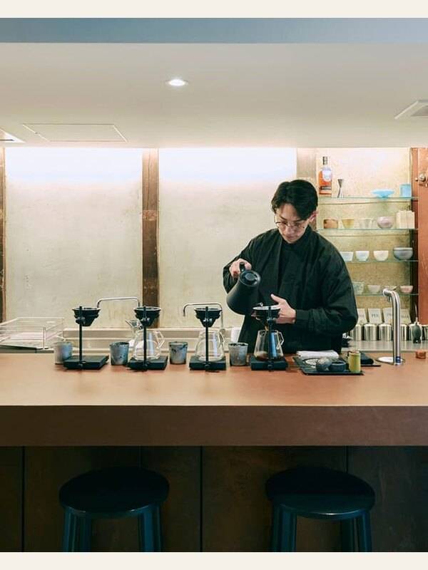</td>
    <td>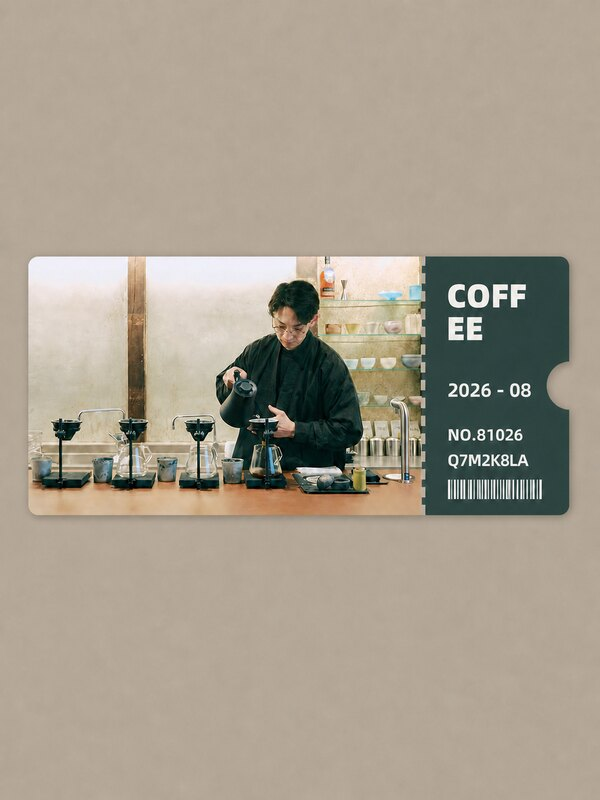</td>
  </tr>
</table>

### 02 · Koala encounter

<table>
  <tr><th>Original</th><th>Generated ticket poster</th></tr>
  <tr>
    <td>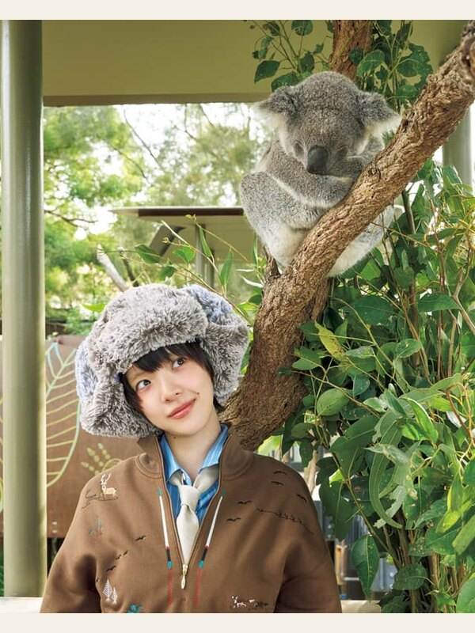</td>
    <td>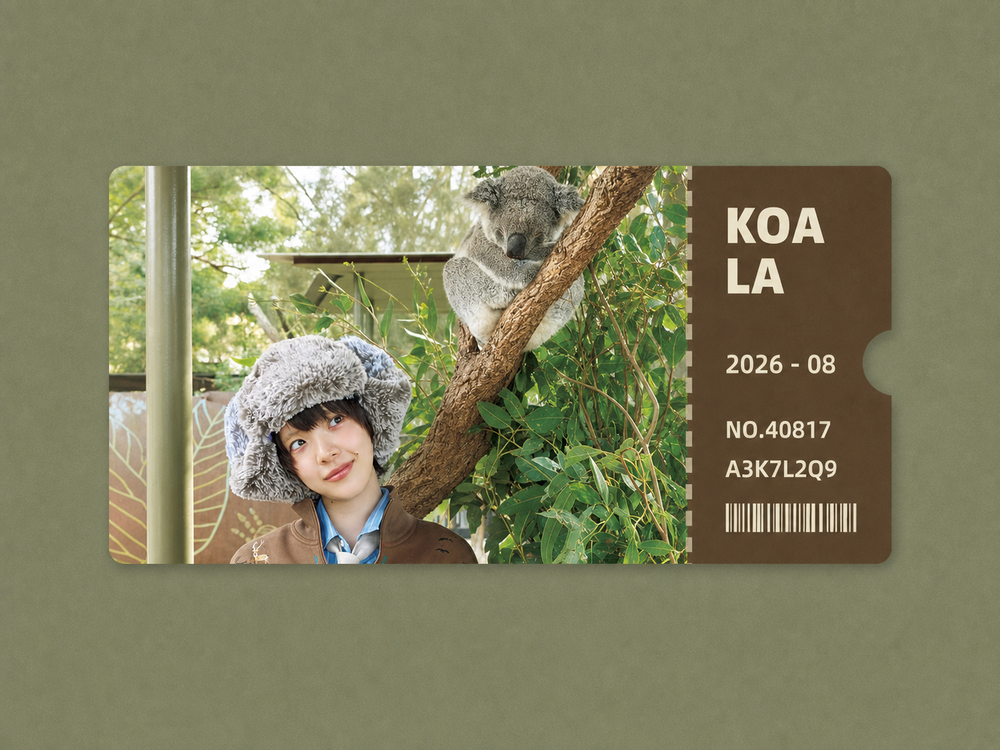</td>
  </tr>
</table>

### 03 · Heritage architecture

<table>
  <tr><th>Original</th><th>Generated ticket poster</th></tr>
  <tr>
    <td></td>
    <td>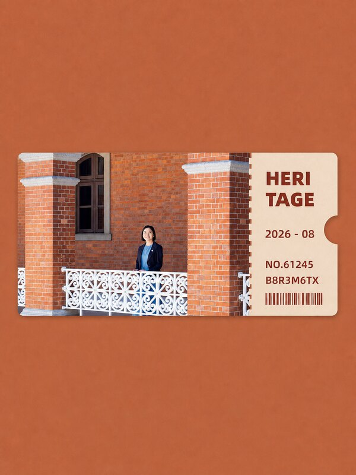</td>
  </tr>
</table>

### 04 · Open-air theater

<table>
  <tr><th>Original</th><th>Generated ticket poster</th></tr>
  <tr>
    <td>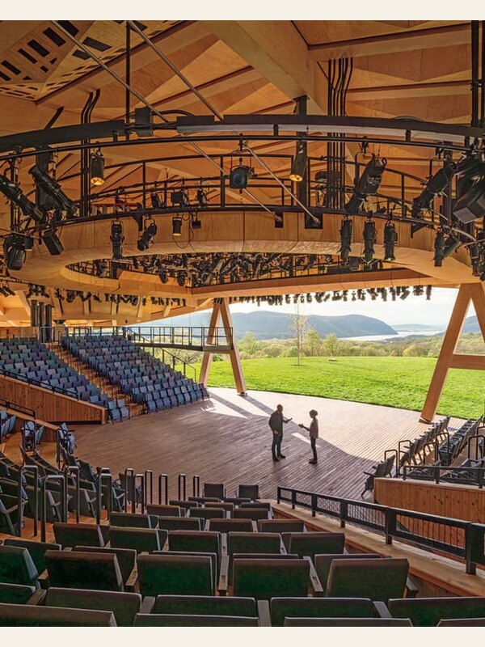</td>
    <td>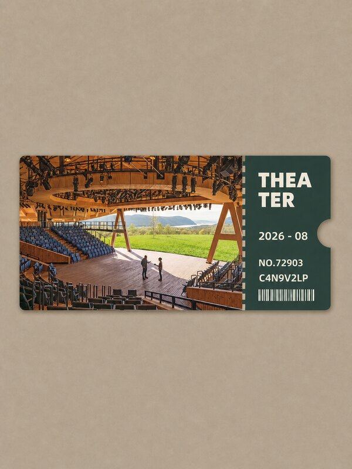</td>
  </tr>
</table>

### 05 · Boutique interior

<table>
  <tr><th>Original</th><th>Generated ticket poster</th></tr>
  <tr>
    <td>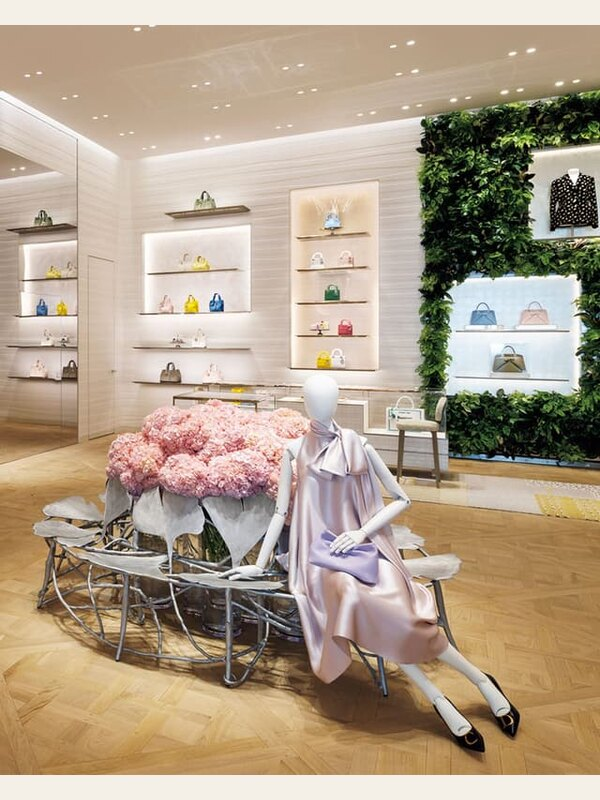</td>
    <td>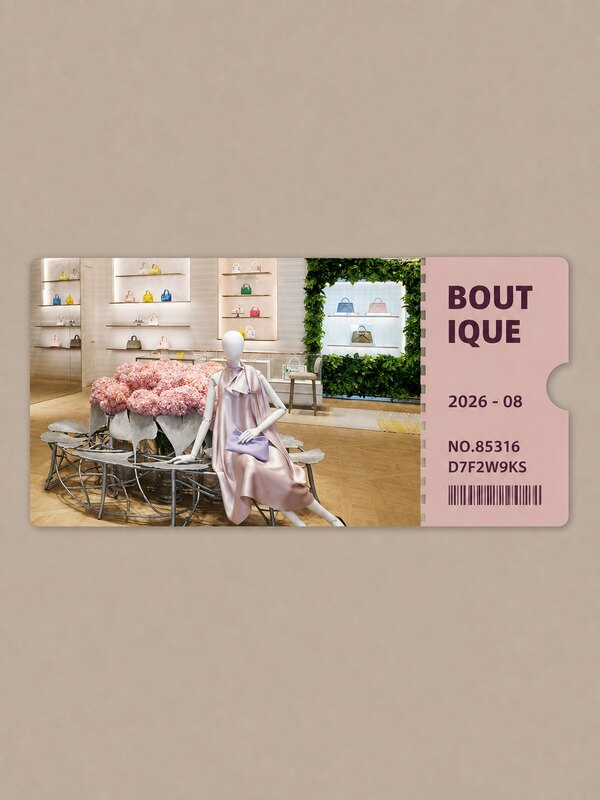</td>
  </tr>
</table>

### 06 · Old town street

<table>
  <tr><th>Original</th><th>Generated ticket poster</th></tr>
  <tr>
    <td>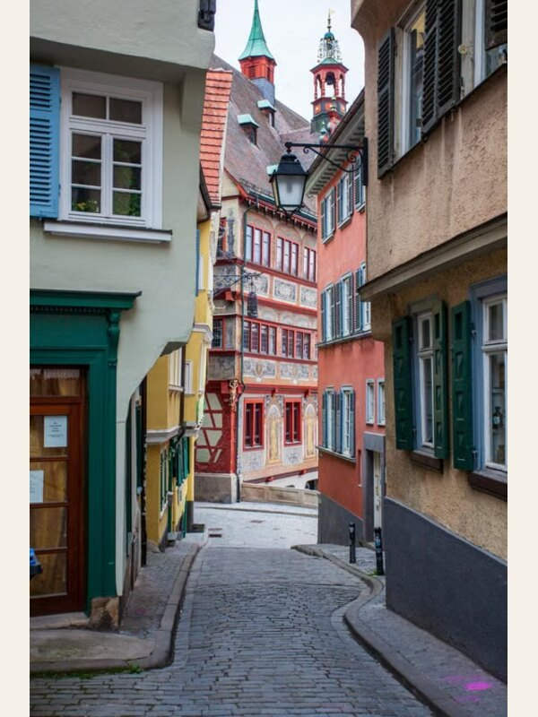</td>
    <td>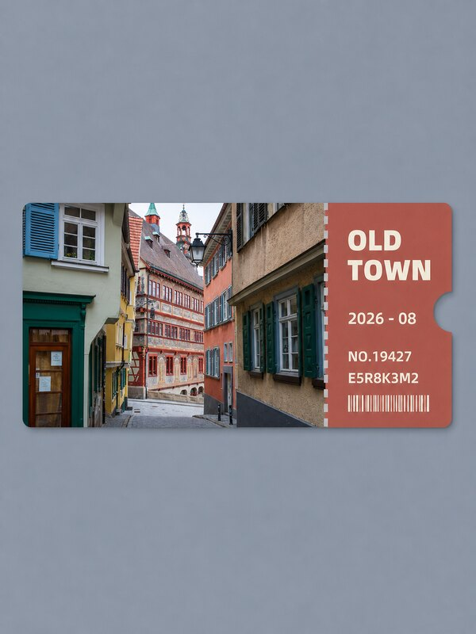</td>
  </tr>
</table>

### 07 · Café table

<table>
  <tr><th>Original</th><th>Generated ticket poster</th></tr>
  <tr>
    <td>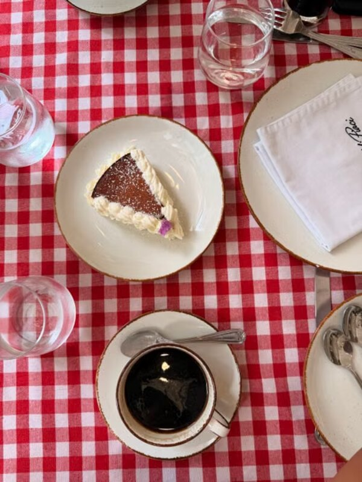</td>
    <td>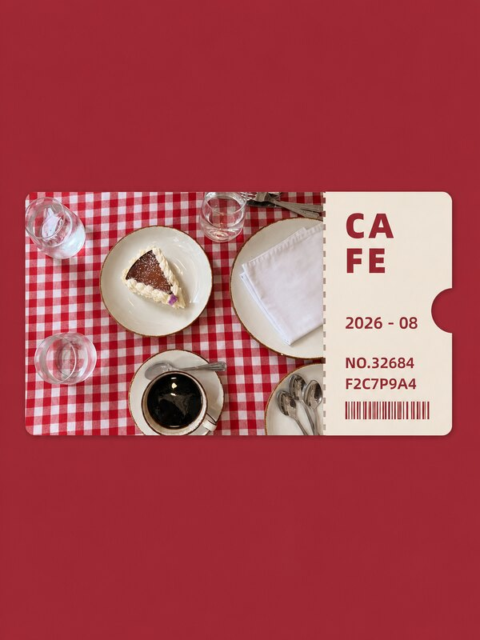</td>
  </tr>
</table>

### 08 · Desert drive

<table>
  <tr><th>Original</th><th>Generated ticket poster</th></tr>
  <tr>
    <td>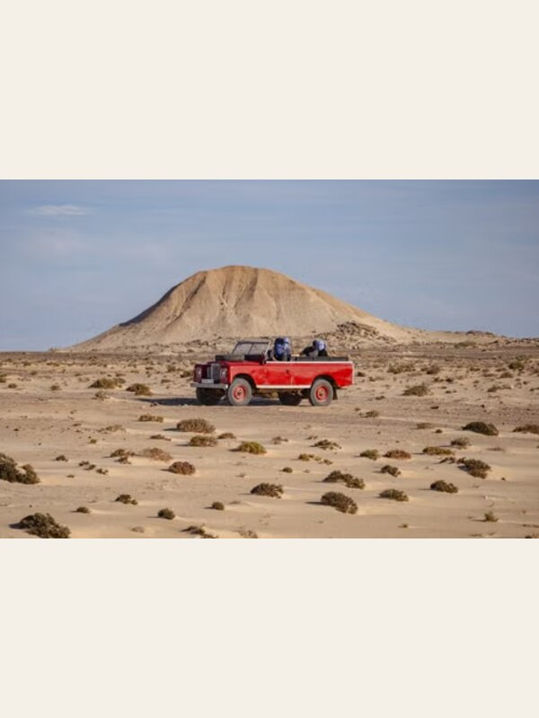</td>
    <td>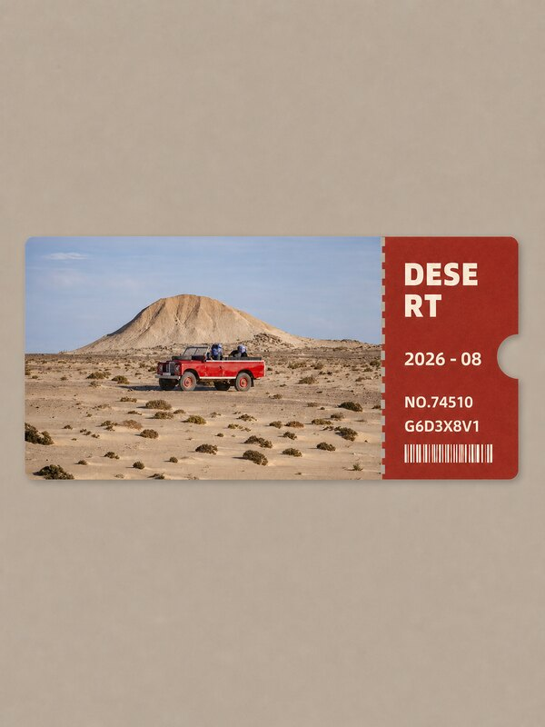</td>
  </tr>
</table>

### 09 · Waterfront photographer

<table>
  <tr><th>Original</th><th>Generated ticket poster</th></tr>
  <tr>
    <td>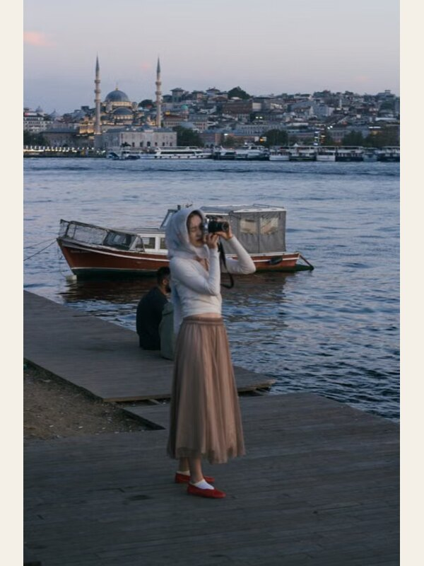</td>
    <td>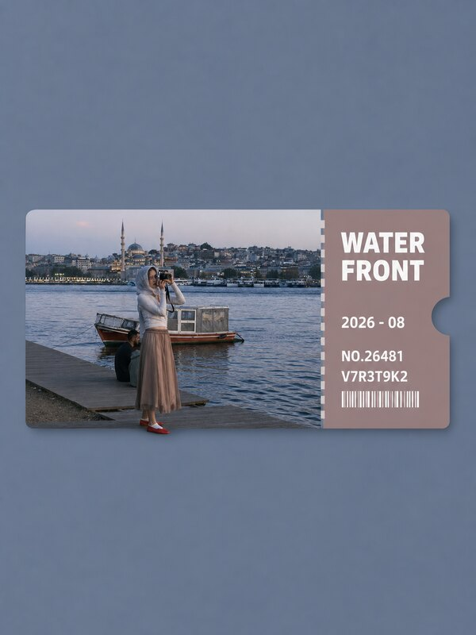</td>
  </tr>
</table>

### 10 · Lakeside view

<table>
  <tr><th>Original</th><th>Generated ticket poster</th></tr>
  <tr>
    <td>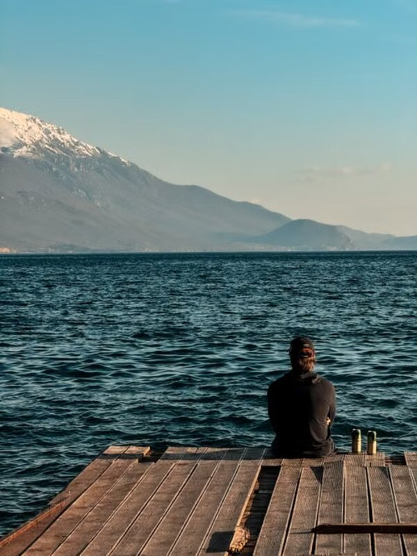</td>
    <td>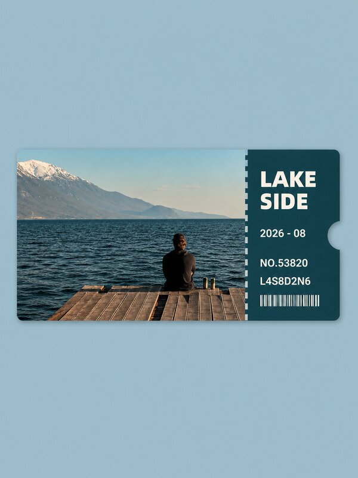</td>
  </tr>
</table>

### 11 · Gold house

<table>
  <tr><th>Original</th><th>Generated ticket poster</th></tr>
  <tr>
    <td>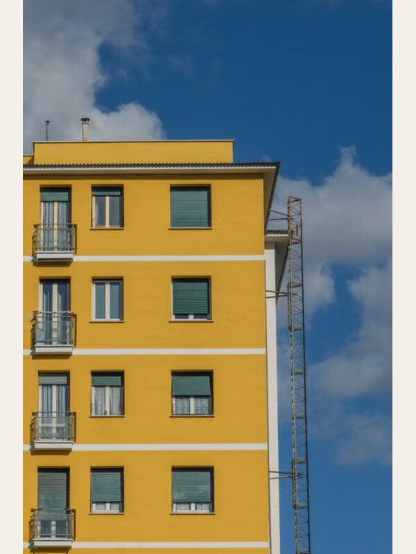</td>
    <td>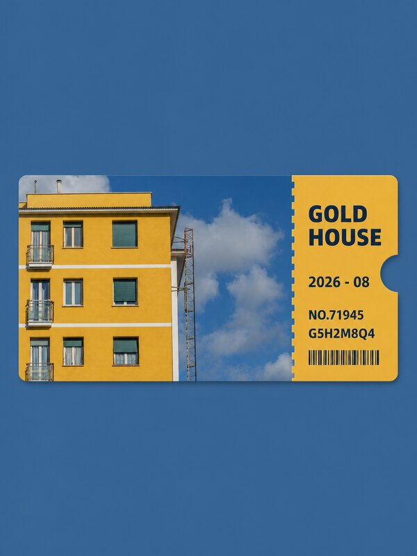</td>
  </tr>
</table>

## Repository layout

```text
.
├── SKILL.md
├── agents/openai.yaml
├── assets/cases/
├── requirements.txt
├── references/
│   ├── palette-system.md
│   ├── prompt-template.md
│   └── style-spec.md
├── scripts/
│   ├── build_before_after_showcase.py
│   ├── build_ticket_batch.py
│   ├── image_utils.py
│   ├── normalize_output.sh
│   ├── normalize_reference_layout.py
│   ├── palette_utils.py
│   ├── recolor_existing_poster.py
│   ├── render_ticket_poster.py
│   ├── suggest_palette.py
│   ├── test_ticket_pipeline.py
│   └── validate_ticket_output.py
└── README.md
```

## Content boundaries

The Skill does not invent a city when the image cannot support one. It also avoids adding new people, animals, products, vehicles, buildings, logos, or other identity-bearing details. Any background extension is limited to non-semantic scenery and should be disclosed with the delivery.
