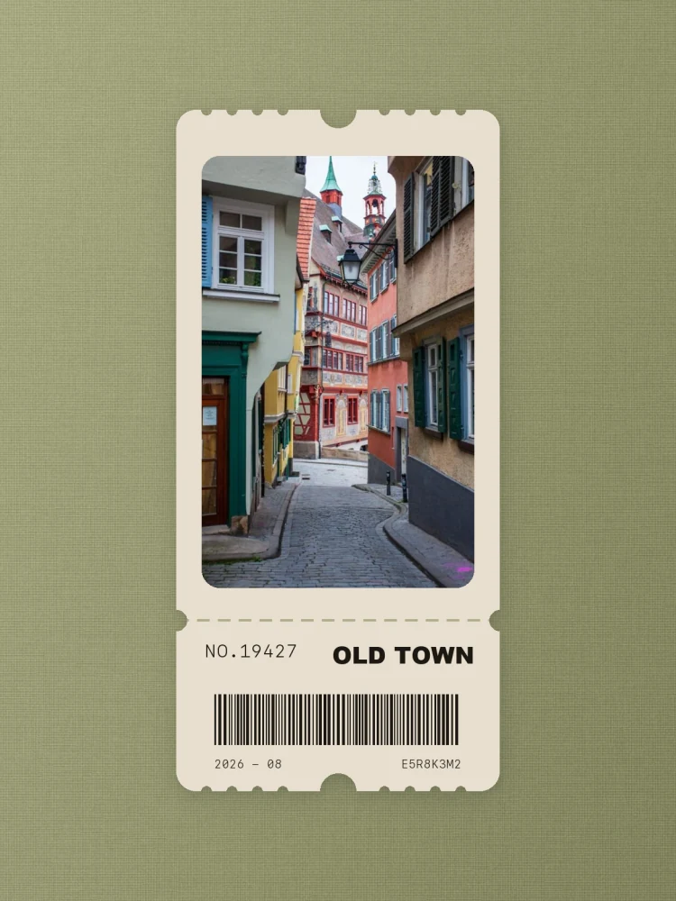
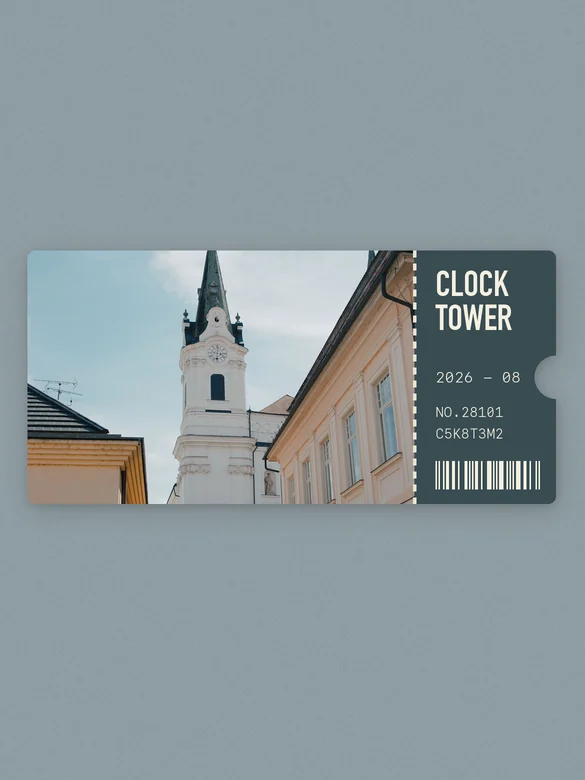

# DY Travel Ticket Poster

English | [简体中文](README.md) | [Live preview: 2 layouts and 12 styles](https://cxcxy.github.io/dy-travel-ticket-poster/)

Turn one photo or a group of photos into travel-ticket posters. Two compositions are available: the original horizontal photo ticket and a portrait-photo keepsake ticket with its information block below. Layout and background can be combined independently.

## Reference cases

Here are a few examples. The left column is the original photo and the right column is the ticket poster.

| Case | Original | Ticket poster |
| --- | --- | --- |
| Coffee counter |  |  |
| Koala encounter |  |  |
| Heritage architecture |  |  |
| Open-air theater |  |  |
| Boutique interior |  |  |
| Old town street |  |  |
| Café table |  |  |
| Desert drive |  |  |
| Waterfront photographer |  |  |
| Lakeside view |  |  |
| Gold house |  |  |
| Old-town portrait keepsake |  |  |

## What it can do

- Turn one photo into one ticket poster
- Turn a group of photos into a matching set
- Choose between a horizontal photo/right stub and a portrait photo/bottom stub
- Keep the important people, animals, buildings, vehicles, and objects in your photos
- Add a title, date, number, and ticket information
- Choose a background that matches the photo, or request one shared color
- Keep the original image proportion without stretching or distortion

## Two ticket layouts

| Layout | Parameter | Best for |
| --- | --- | --- |
| Original horizontal | `landscape` (default) | Wide scenes, groups, and architecture; photo left, information right |
| Portrait keepsake | `portrait` | Vertical streets, architecture, portraits, and narrow compositions; rounded photo above, information and a large barcode below |

Both layouts support every existing background option: photo-derived matte color, a user color, a shared batch color family, and all 12 material/light styles below. Their defaults differ: `landscape` follows the photo color, while `portrait` uses the reference's muted olive woven-fabric background, warm-ivory ticket paper, and near-black ink. Any explicit palette or background choice overrides that default.

| Landscape default | Portrait default |
| --- | --- |
|  |  |

```text
Turn this image into a portrait keepsake ticket and use background style 10.
```

## How to use it

### 1. Install the Skill

The simplest installation message is:

```text
Please install this Skill: https://github.com/cxcxy/dy-travel-ticket-poster
```

This Skill is not limited to Codex. It uses the standard `SKILL.md` format and can be used with these Agents:

#### Tools that can read Skills directly

| Tool | How to install | How to use it after installation |
| --- | --- | --- |
| Codex | Send the repository link in chat and ask it to install the Skill | Say “turn this image into a travel ticket poster” |
| Claude Code | Put the repository folder in `~/.claude/skills/dy-travel-ticket-poster/` | Type `/dy-travel-ticket-poster`, or describe the task |
| Gemini CLI | Run `gemini skills install https://github.com/cxcxy/dy-travel-ticket-poster` | Check with `/skills list`, then describe the task |
| Kimi Code | Put the repository folder in `~/.kimi-code/skills/dy-travel-ticket-poster/` | Type `/skill:dy-travel-ticket-poster`, then describe the task |
| Tencent Cloud CodeBuddy | Put `SKILL.md` in `.codebuddy/skills/dy-travel-ticket-poster/` in the project | Start a new task and describe the task |

#### Other common Agent tools

These tools can also use the Skill, but usually require you to copy `SKILL.md` into their project rules, custom instructions, or Skills area first:

| Tool | Type |
| --- | --- |
| Cursor | Popular international coding Agent |
| Windsurf | Popular international coding Agent |
| Cline, Roo Code | VS Code Agent extensions |
| GitHub Copilot, Copilot CLI | GitHub Agents |
| Trae | ByteDance Agent |
| Tongyi Lingma, MarsCode | Chinese coding Agents |
| CodeGeeX, GLM coding tools | Chinese coding Agents |
| Baidu Comate | Chinese coding Agent |
| Coze (扣子) | Chinese Agent platform |
| Doubao（豆包） | Chinese AI assistant |

Menu names can change between versions. If a tool has no “Install Skill” button, copy the contents of `SKILL.md` into its project rules, or say:

```text
Please read the SKILL.md file in this repository and follow it to turn this image into a travel ticket poster.
```

If the tool does not recognize it right away, close and reopen the current task.

### 2. Prepare your photos

Upload one or more clear PNG or JPG photos. Travel scenes, people, animals, buildings, cafés, and everyday moments all work well.

### 3. Start with the default, then change the style if you want

The simplest option is to make the poster without choosing a style:

```text
Use the default style.
```

The default depends on the layout: `landscape` derives a restrained matte-paper background from the photo, while `portrait` uses the reference-locked olive linen, warm-ivory ticket paper, and near-black ink.

Only if you want a different look, open the [2-layout and 12-style preview](https://cxcxy.github.io/dy-travel-ticket-poster/) and tell the Skill the layout, number, or Chinese name you like.

For example:

```text
Use style 10.
```

Or:

```text
Use “象牙洞石斜光”.
```

### 4. Process several photos

Send several images together without choosing a style to use the default:

```text
Turn this group of photos into separate ticket posters.
```

To use another style, add it to the request:

```text
Turn this group of photos into separate ticket posters, all using style 10.
```

Each photo becomes its own poster. They will not be merged into a collage.

### 5. Ask for changes

You can keep refining the result in plain language:

```text
Change the background to style 2 and keep everything else the same.
```

```text
Change the title to WATERFRONT and the date to 2026 - 08.
```

## Choose one of the 12 styles only when you want a different look

| No. | Chinese name | Overall feeling |
| --- | --- | --- |
| 01 | 暖灰亚麻侧光 | Warm, soft, textile-like |
| 02 | 象牙艺术纸柔窗影 | Bright, clean, art-paper feel |
| 03 | 沙岩中心柔光 | Natural, warm, brighter in the center |
| 04 | 蘑菇灰电影墙 | Quiet, mature, cinematic |
| 05 | 焦糖树影墙 | Warm, sunny, leafy shadows |
| 06 | 天然和纸柔光 | Light, calm, handmade paper |
| 07 | 暖灰灰泥柔影 | Soft, with subtle wall depth |
| 08 | 象牙灰泥窗光 | Bright, with architectural window light |
| 09 | 奶油石灰墙漫射 | Creamy, soft, natural |
| 10 | 象牙洞石斜光 | Bright, premium, diagonal light |
| 11 | 棉纸顶光 | Clean, even, cotton-paper feel |
| 12 | 焦糖矿物聚光 | Deep warm tone, focused atmosphere |

## What happens by default

- Without a background request, `landscape` follows each photo's main color and adds fine matte paper texture.
- Without an explicit style request, `portrait` uses the reference's muted olive woven fabric, warm-ivory ticket paper, and near-black ink; the background uses slightly irregular 4–5 px yarn spacing with rounded thread highlights and a gentle upper-left to lower-right light falloff.
- In a landscape batch, each photo gets its own matching color; a portrait batch keeps the same reference-locked olive, ivory, and near-black identity by default.
- To use one color family for all photos, say “use one shared blue-gray color family”.
- If you do not provide a title, place, or date, the Skill uses simple neutral wording instead of guessing.

## Ready-to-copy examples

```text
Use $dy-travel-ticket-poster to turn this image into a ticket poster.
```

```text
Use $dy-travel-ticket-poster to turn this image into a ticket poster with style 5.
```

```text
Use $dy-travel-ticket-poster to make a portrait keepsake ticket with a photo-derived background.
```

```text
Use $dy-travel-ticket-poster to turn this group of photos into separate posters, all using style 10 and one shared blue-gray color family.
```

```text
Use $dy-travel-ticket-poster and recommend 3 styles that fit this photo before making the poster.
```

## If you are not sure what to say

You only need to provide:

1. The photo or photos
2. If you want another style, its number or name; otherwise the default is used
3. Any title, date, or shared color you want

For example:

```text
Use this travel photo with style 8. Set the title to OLD TOWN and the date to 2026 - 08.
```

## 2026-08-20 update

- Added the `portrait` keepsake layout with a vertical photo, horizontal tear line, scalloped top/bottom edges, bottom information, and a large barcode.
- The complete `portrait` default now matches the reference: muted olive woven fabric, warm-ivory ticket paper, and near-black ink; photo-derived, solid, unified, and 12-style choices remain explicit overrides.
- The live gallery now includes a landscape/portrait comparison, a portrait-first showcase, and copyable layout prompts.
- Palette provenance, batch manifests, PNG metadata, and strict validation now lock the selected layout.

## 2026-08-15 update

- Added 12 selectable background styles.
- The default background now uses the photo's restrained main color with fine matte paper texture.
- Added support for single-photo and batch creation.
- Added an online preview page so you can compare styles before choosing one.
