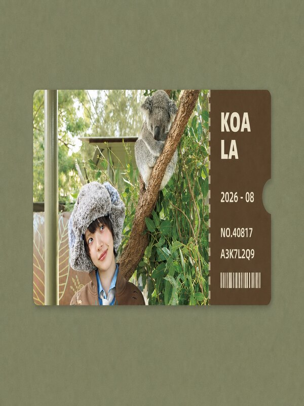

# DY 旅行票根海报

[English](README.md) | 简体中文

把单张照片或一批照片做成风格统一的旅行票根海报。Skill 会保留原图中可辨认的人物、动物、建筑、车辆、产品和动作，再根据照片颜色制作居中的票根、撕票信息联、场景标题、日期、编号和装饰性条形码。

每张照片最终交付一张 `1170 × 1560`、`3:4`、无透明通道的 PNG。成品中不会保留手机状态栏、通知、播放器控件和水印。

## 安装

### 直接让 Codex 安装（推荐）

把下面这句话直接发给 Codex：

```text
请帮我安装这个 Skill：https://github.com/cxcxy/dy-travel-ticket-poster，并在安装完成后检查 Codex 是否能够识别它。
```

### Codex 手动安装

```bash
git clone https://github.com/cxcxy/dy-travel-ticket-poster.git
cd dy-travel-ticket-poster
mkdir -p "${CODEX_HOME:-$HOME/.codex}/skills"
cp -R . "${CODEX_HOME:-$HOME/.codex}/skills/dy-travel-ticket-poster"
```

### Claude Code

```bash
mkdir -p ~/.claude/skills
git clone https://github.com/cxcxy/dy-travel-ticket-poster.git ~/.claude/skills/dy-travel-ticket-poster
```

### Cursor

```bash
mkdir -p ~/.cursor/skills
git clone https://github.com/cxcxy/dy-travel-ticket-poster.git ~/.cursor/skills/dy-travel-ticket-poster
```

### Gemini CLI

```bash
mkdir -p ~/.gemini/skills
git clone https://github.com/cxcxy/dy-travel-ticket-poster.git ~/.gemini/skills/dy-travel-ticket-poster
```

### GitHub Copilot

```bash
mkdir -p ~/.copilot/skills
git clone https://github.com/cxcxy/dy-travel-ticket-poster.git ~/.copilot/skills/dy-travel-ticket-poster
```

### 其他兼容 Agent Skills 的 Agent

如果 Agent 支持通用的个人 Skills 目录，可以安装到 `~/.agents/skills`。Codex、Cursor、Gemini CLI 和 GitHub Copilot 等支持该共享目录的客户端，也可以通过这种方式共用一份安装。

```bash
mkdir -p ~/.agents/skills
git clone https://github.com/cxcxy/dy-travel-ticket-poster.git ~/.agents/skills/dy-travel-ticket-poster
```

手动安装完成后，重新启动或刷新对应 Agent，让它重新扫描 Skills。标准票根由本地 Python、Pillow 和粗体字体确定性完成；只有裁切必然损失关键主体、需要扩展无语义环境时，Agent 才需要图片生成或编辑能力。Codex 可在该例外路径使用 `imagegen` Skill。

## 能做什么

- 保留原图中的人物身份、动物、产品、建筑、车辆和关键动作
- 在主体完整的前提下保留足够的环境信息
- 在最终裁切上生成三套照片环境色方案，目视选择背景、信息联和文字色
- 用确定性脚本锁定原图像素、文字、条码、几何、虚线、缺口和阴影
- 优先采用用户给出的标题、地点和日期
- 地点无法可靠确认时，改用中性场景词
- 自动生成五位编号、八位装饰码和装饰性条形码
- 批量处理时每张照片独立出图，同时保持统一版式
- 将通过检查的成品输出为 `1170 × 1560` RGB PNG，并保留原始文件

## 视觉系统

整套海报使用固定、克制、可重复的布局。

- 画布比例为 `3:4`
- 票根水平居中，宽度约占画布的 `90.4%`
- 票根高度约占画布的 `32.5%`
- 照片区约占票根宽度的 `73.2%`
- 信息联约占票根宽度的 `26.8%`
- 小圆角、唯一方角撕票线、半圆缺口、双层阴影和粗体排版保持一致
- 背景使用照片环境色的三案筛选，信息层级和版式保持不变

完整的版式参数见 [references/style-spec.md](references/style-spec.md)。

## 使用方法

附上一张或多张本地 PNG、JPG 照片，然后让当前 Agent 使用这个 Skill。

```text
使用 $dy-travel-ticket-poster，把这些照片做成统一的 3:4 旅行票根海报。
```

也可以直接指定标题和日期。

```text
使用 $dy-travel-ticket-poster 处理这张照片，标题用 WATERFRONT，日期用 2026 - 08。
```

工作流会逐张检查照片和最终裁切，使用 [scripts/suggest_palette.py](scripts/suggest_palette.py) 生成三套可追溯的配色预览，目视选择后由 [scripts/render_ticket_poster.py](scripts/render_ticket_poster.py) 确定性合成，再通过 [scripts/validate_ticket_output.py](scripts/validate_ticket_output.py) 检查原图像素、背景纯色、颜色层级、文字对比和票根结构。只有裁切必然损失关键主体时，才调用 `imagegen` 扩展无语义环境。

## 信息生成规则

- 用户提供的标题、地点和日期拥有最高优先级
- 没有可靠地点信息时，使用 `COFFEE`、`KOALA`、`OLD TOWN`、`DESERT` 这类中性场景词
- 日期依次采用用户指定值、本地 `DateTimeOriginal`、本地文件日期、当前年月
- GPS 和私人元数据只在本地读取，不会写入图片生成请求
- 编号、装饰码和条形码只承担视觉作用，不保证能够扫描

## 环境要求

- 支持 `SKILL.md` 的 Agent Skills 环境
- Python 3.10+、`requirements.txt` 中声明的 Pillow，以及可用的粗体 TTF/OTF/TTC 字体；同批建议固定字体路径，成品会内嵌字体名称与 SHA-256 供验证
- 只有需要扩展无语义环境时才需要图片生成或编辑工具；Codex 可使用 `imagegen` Skill
- ImageMagick 仅用于旧成品的兼容归一化路径
- 本地可以访问需要处理的原始照片

先生成配色候选与预览：

```bash
python3 scripts/suggest_palette.py --input source.jpg --output-json palette.json --preview palette-review.png
```

完整渲染和验证命令见 [SKILL.md](SKILL.md)。

## 参考案例

下面展示原始照片和早期视觉案例。它们用于说明照片派生配色和整体方向，不是新版像素验证金样；新版实际输出为 `1170 × 1560` RGB PNG，并以 `SKILL.md`、视觉规范和验证器为准。

### 01 · 咖啡吧台

<table>
  <tr><th>原图</th><th>生成的票根海报</th></tr>
  <tr>
    <td></td>
    <td></td>
  </tr>
</table>

### 02 · 考拉合影

<table>
  <tr><th>原图</th><th>生成的票根海报</th></tr>
  <tr>
    <td></td>
    <td></td>
  </tr>
</table>

### 03 · 历史建筑

<table>
  <tr><th>原图</th><th>生成的票根海报</th></tr>
  <tr>
    <td></td>
    <td></td>
  </tr>
</table>

### 04 · 露天剧场

<table>
  <tr><th>原图</th><th>生成的票根海报</th></tr>
  <tr>
    <td></td>
    <td></td>
  </tr>
</table>

### 05 · 精品店陈列

<table>
  <tr><th>原图</th><th>生成的票根海报</th></tr>
  <tr>
    <td></td>
    <td></td>
  </tr>
</table>

### 06 · 老城街道

<table>
  <tr><th>原图</th><th>生成的票根海报</th></tr>
  <tr>
    <td></td>
    <td></td>
  </tr>
</table>

### 07 · 咖啡与甜点

<table>
  <tr><th>原图</th><th>生成的票根海报</th></tr>
  <tr>
    <td></td>
    <td></td>
  </tr>
</table>

### 08 · 沙漠行车

<table>
  <tr><th>原图</th><th>生成的票根海报</th></tr>
  <tr>
    <td></td>
    <td></td>
  </tr>
</table>

### 09 · 水岸摄影

<table>
  <tr><th>原图</th><th>生成的票根海报</th></tr>
  <tr>
    <td></td>
    <td></td>
  </tr>
</table>

### 10 · 湖边远眺

<table>
  <tr><th>原图</th><th>生成的票根海报</th></tr>
  <tr>
    <td></td>
    <td></td>
  </tr>
</table>

### 11 · 黄色住宅

<table>
  <tr><th>原图</th><th>生成的票根海报</th></tr>
  <tr>
    <td></td>
    <td></td>
  </tr>
</table>

## 仓库结构

```text
.
├── SKILL.md
├── agents/openai.yaml
├── assets/cases/
├── references/
│   ├── palette-system.md
│   ├── prompt-template.md
│   └── style-spec.md
├── scripts/
│   ├── suggest_palette.py
│   ├── render_ticket_poster.py
│   ├── validate_ticket_output.py
│   └── normalize_reference_layout.py
└── requirements.txt
```

## 内容边界

画面无法证明具体城市时，Skill 不会猜测地点。制作过程中也不会新增人物、动物、商品、车辆、建筑、标识或其他带有身份信息的细节。确实需要扩展背景时，只处理没有语义的环境区域，并在交付说明中标出。
